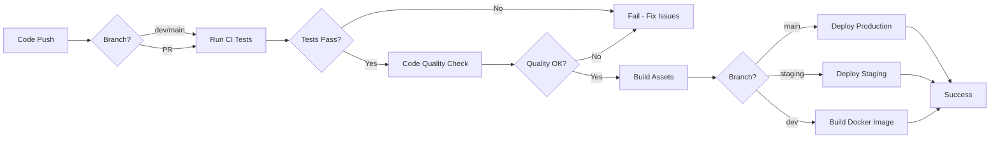

# GitHub Actions CI/CD Pipeline Documentation

This project uses GitHub Actions for automated Continuous Integration and Continuous Deployment (CI/CD).

## 📋 Overview

The CI/CD pipeline consists of multiple workflows:

| Workflow          | File                    | Trigger                    | Purpose                                      |
| ----------------- | ----------------------- | -------------------------- | -------------------------------------------- |
| CI Tests          | `ci.yml`                | Push/PR to `dev`, `main`   | Run tests, code quality checks, build assets |
| Deploy            | `deploy.yml`            | Push to `main`/`staging`   | Deploy to production/staging servers         |
| Docker Build      | `docker.yml`            | Push to `main`/`dev`, Tags | Build and push Docker images                 |
| Dependency Review | `dependency-review.yml` | Pull Requests              | Review dependency changes for security       |

## 🔄 Workflows

### 1. CI - Tests and Code Quality (`ci.yml`)

**Triggers:**

-   Push to `dev` or `main` branches
-   Pull requests to `dev` or `main` branches

**Jobs:**

#### Test Job

-   Runs on PHP 8.2 and 8.3 (matrix)
-   Uses MySQL 8.0 and Redis services
-   Executes PHPUnit tests with coverage
-   Minimum coverage requirement: 80%
-   Uploads coverage to Codecov

#### Code Quality Job

-   Runs Laravel Pint for code style checking
-   Runs Composer audit for security vulnerabilities

#### Build Check Job

-   Installs NPM dependencies
-   Builds frontend assets with Vite
-   Uploads build artifacts

**Environment Variables:**

-   Tests use `lv_warehouse_test` database
-   Redis and MySQL run as service containers

### 2. CD - Deploy to Server (`deploy.yml`)

**Triggers:**

-   Push to `main` → Deploy to production
-   Push to `staging` → Deploy to staging
-   Manual workflow dispatch

**Deployment Steps:**

1. Checkout latest code
2. Setup SSH connection
3. Pull latest changes on server
4. Install Composer dependencies (production)
5. Build frontend assets
6. Run database migrations
7. Cache configurations
8. Restart queue workers
9. Set proper permissions

**Rollback:**

-   Automatic rollback on failure
-   Reverts to previous commit

**Required Secrets:**

For **Production**:

-   `PROD_HOST` - Production server hostname/IP
-   `PROD_USER` - SSH username
-   `PROD_PATH` - Application path on server
-   `PROD_URL` - Production URL

For **Staging**:

-   `STAGING_HOST` - Staging server hostname/IP
-   `STAGING_USER` - SSH username
-   `STAGING_PATH` - Application path on server
-   `STAGING_URL` - Staging URL

For **Both**:

-   `SSH_PRIVATE_KEY` - Private SSH key for authentication

### 3. Docker Build and Push (`docker.yml`)

**Triggers:**

-   Push to `main` or `dev` branches
-   Version tags (`v*.*.*`)
-   Pull requests to `main`
-   Manual workflow dispatch

**Features:**

-   Builds multi-platform images (AMD64, ARM64)
-   Pushes to GitHub Container Registry (ghcr.io)
-   Automatic tagging based on branch/tag/commit
-   Layer caching for faster builds
-   Vulnerability scanning with Trivy

**Image Tags:**

-   `latest` - Latest from main branch
-   `dev` - Latest from dev branch
-   `v1.2.3` - Semantic version tags
-   `main-sha123abc` - Commit-specific tags

### 4. Dependency Review (`dependency-review.yml`)

**Triggers:**

-   Pull requests to `main` or `dev`

**Features:**

-   Reviews dependency changes
-   Identifies security vulnerabilities
-   Posts summary in PR comments
-   Fails on moderate or higher severity issues

## 🔐 Setting Up Secrets

Navigate to your repository: `Settings` → `Secrets and variables` → `Actions`

### Required Secrets:

```bash
# SSH Deployment
SSH_PRIVATE_KEY          # Your private SSH key

# Production Environment
PROD_HOST               # e.g., production.example.com
PROD_USER               # e.g., deployer
PROD_PATH               # e.g., /var/www/warehouse-app
PROD_URL                # e.g., https://warehouse.example.com

# Staging Environment
STAGING_HOST            # e.g., staging.example.com
STAGING_USER            # e.g., deployer
STAGING_PATH            # e.g., /var/www/staging-warehouse
STAGING_URL             # e.g., https://staging.warehouse.example.com
```

### Setting Up Environments

1. Go to `Settings` → `Environments`
2. Create two environments: `production` and `staging`
3. Add protection rules:
    - **Production**: Require approvals, restrict to `main` branch
    - **Staging**: Restrict to `staging` branch

## 🚀 Usage

### Running Tests Automatically

Tests run automatically on every push and pull request:

```bash
git push origin dev
# Triggers CI workflow
```

### Manual Deployment

Go to `Actions` → `CD - Deploy to Server` → `Run workflow`

-   Select branch
-   Choose environment (staging/production)
-   Click "Run workflow"

### Building Docker Images

Push to main or dev, or create a version tag:

```bash
# Tag-based build
git tag v1.0.0
git push origin v1.0.0

# Branch-based build
git push origin main
```

### Viewing Workflow Results

1. Go to the `Actions` tab in your repository
2. Click on a workflow run
3. View logs, artifacts, and deployment status

## 📊 Status Badges

Add these to your README.md:

```markdown


```

## 🔧 Local Testing

Test workflows locally using [act](https://github.com/nektos/act):

```bash
# Install act
brew install act  # macOS
# or
curl https://raw.githubusercontent.com/nektos/act/master/install.sh | sudo bash

# Run CI workflow
act push

# Run specific job
act -j test

# List all workflows
act -l
```

## 📝 Workflow Customization

### Modify PHP Versions

Edit `.github/workflows/ci.yml`:

```yaml
matrix:
    php-version: ["8.2", "8.3", "8.4"] # Add/remove versions
```

### Adjust Test Coverage

Edit `.github/workflows/ci.yml`:

```yaml
run: php artisan test --coverage --min=90 # Change from 80 to 90
```

### Add Additional Checks

Create new workflow files in `.github/workflows/`:

```yaml
# .github/workflows/custom-check.yml
name: Custom Check
on: [push, pull_request]
jobs:
    check:
        runs-on: ubuntu-latest
        steps:
            - uses: actions/checkout@v4
            # Your custom steps
```

## 🐛 Troubleshooting

### Tests Failing

-   Check test logs in Actions tab
-   Ensure database migrations are up to date
-   Verify service containers are healthy

### Deployment Failing

-   Verify SSH key is correct and has proper permissions
-   Check server path exists and is accessible
-   Ensure server has required PHP version and extensions
-   Verify database credentials on server

### Docker Build Failing

-   Check Dockerfile syntax
-   Ensure all required files exist
-   Verify base image is accessible
-   Check for sufficient runner disk space

### Permission Issues on Server

```bash
# SSH into server and run:
chmod -R 775 storage bootstrap/cache
chown -R www-data:www-data storage bootstrap/cache
```

## 📚 Additional Resources

-   [GitHub Actions Documentation](https://docs.github.com/en/actions)
-   [Laravel Deployment Guide](https://laravel.com/docs/deployment)
-   [Docker Documentation](https://docs.docker.com/)
-   [GitHub Container Registry](https://docs.github.com/en/packages/working-with-a-github-packages-registry/working-with-the-container-registry)

## 🔄 Workflow Lifecycle



## ⚙️ Best Practices

1. **Always test locally** before pushing
2. **Use pull requests** for code review
3. **Tag releases** with semantic versioning
4. **Monitor workflows** regularly
5. **Keep dependencies updated**
6. **Review security alerts** promptly
7. **Use environment-specific secrets**
8. **Test deployment process** in staging first
9. **Keep workflow files** well-documented
10. **Set up notifications** for failed workflows

## 🔔 Notifications

Configure notifications in GitHub:

1. Go to `Settings` → `Notifications`
2. Enable "Actions" notifications
3. Choose delivery method (email/web)

Or use third-party integrations:

-   Slack
-   Discord
-   Microsoft Teams
-   Email

## 📈 Monitoring

Track your CI/CD metrics:

-   Build success rate
-   Average build time
-   Deployment frequency
-   Test coverage trends
-   Failed deployments

Use GitHub Insights:

1. Go to `Insights` tab
2. View `Actions` analytics
3. Monitor workflow runs and trends
